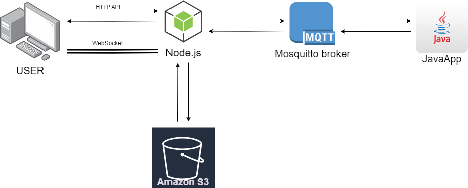

English | [Italiano](README-it.md)

# MapSnap
<h3 align="center">Explore the World through the Eyes of the Community.</h3>

**MapSnap** is an interactive web application that allows users to explore and share geotagged photographs. Using an interactive map, you can search for images based on location or hashtags, upload your own photos, and view content shared by the community. The application combines a frontend developed with React, a backend based on Node.js and Java, and uses MQTT for communication between Node.js and Java. Images are stored on Amazon S3, and metadata is stored in a PostgreSQL database.

## Summary
1. [Main Features](#main-features)
   - [User Side](#user-side)
   - [Technical Side](#technical-side)

2. [Usage](#usage)

3. [Technologies Used](#technologies-used)
   - [Frontend](#frontend)
   - [Backend](#backend)

4. [Requirements](#requirements)

5. [Project Structure](#project-structure)
   - [Overall Diagram](#overall-diagram)
   - [Code Structure](#code-structure)
   - [Database Schema](#database-schema)
   - [Amazon S3 Structure](#amazon-s3-structure)

6. [Local Installation and Setup](#local-installation-and-setup)

7. [Local Startup](#local-startup)

8. [EC2 Installation and Setup](#ec2-installation-and-setup)

9. [EC2 Startup](#ec2-startup)

10. [Contributing](#contributing)

<!-- @@@@@@@@@@@@@@@@@@@@@@@@@@@@@@@@@@@@@@@@@@@@@@@@@@@@@@@@@@@@@@@@@@@@@@@@ -->
## Main Features

### User Side
- **Map Exploration**: Navigate the interactive map to search and view photos taken in various locations, or use the search bar to find specific images based on a location or hashtag.
- **Random Search**: Discover new photos randomly selected within the currently visible portion of the map.
- **Photo Upload**: Users can upload geolocated images and add hashtags to facilitate their search. The photos will be displayed on the map at the location where they were taken.
- **User Account**: Registration and login functionality to manage your account and view all uploaded photos.

### Technical Side
- **Backend Architecture**: The backend is divided into two main components:
  - A **Node.js** server that handles API and WebSocket requests.
  - A **Java** application responsible for managing database operations.
- **Communication between Backend Components**: The Node.js server interacts with the Java application via the MQTT protocol to handle database read and write operations.
- **Frontend-Backend Communication**: The frontend communicates with the Node.js server using:
  - HTTP for REST APIs
  - WebSocket for real-time image updates.
- **Image Management**: Actual images are stored on **Amazon S3**, while the **PostgreSQL** database manages their metadata.

<!-- @@@@@@@@@@@@@@@@@@@@@@@@@@@@@@@@@@@@@@@@@@@@@@@@@@@@@@@@@@@@@@@@@@@@@@@@ -->
### **Navigation and Features**
  - **Map Navigation**: Explore the world through the interactive map to find photos based on location.
  - **Search**: Use the search bar to find specific images by entering a location or hashtag.
  - **Random Search**: Click the random search button to discover new and unexpected images.
  - **Photo Upload**: Upload your images, add relevant hashtags, and view the uploaded photos directly on the map.
  - **User Management**: Access your personal area to view and manage the photos you have uploaded.

<!-- @@@@@@@@@@@@@@@@@@@@@@@@@@@@@@@@@@@@@@@@@@@@@@@@@@@@@@@@@@@@@@@@@@@@@@@@ -->
## Technologies Used

### Frontend
- **React**: Library for building the user interface.
- **OpenLayers**: Tool for visualizing and interacting with geospatial maps.
- **FontAwesome**: Set of vector icons for an improved user experience.
- **React Router**: Routing and page management for the application.
- **CSS Modules**: Styling management system with automatic scoping.

### Backend
- **Node.js & Express**: Backend server for managing APIs and application logic.
- **MQTT mosquitto**: MQTT broker for communication between the Node.js server and the Java application.
- **Java**: Programming language used for the application managing the database.
- **Maven**: Dependency management tool for the Java application.
- **PostgreSQL**: Relational database for managing user and image data.
- **Amazon S3**: Cloud storage service for images uploaded by users.

<!-- @@@@@@@@@@@@@@@@@@@@@@@@@@@@@@@@@@@@@@@@@@@@@@@@@@@@@@@@@@@@@@@@@@@@@@@@ -->
## Requirements
- **Node.js**: v14 or higher
- **Java**: JDK 11 or higher
- **MQTT Broker**: (e.g., Mosquitto)

<!-- @@@@@@@@@@@@@@@@@@@@@@@@@@@@@@@@@@@@@@@@@@@@@@@@@@@@@@@@@@@@@@@@@@@@@@@@ -->
## Project Structure

### Overall Diagram
<p align="center">
  
</p>

### Code Structure
```
MapSnap
|
├── client
│   ├── public\InfoImg
|   ├── src
│   |   ├── components
│   |   ├── context
│   |   ├── pages
│   |   ├── style
│   |   ├── App.js
│   |   └── index.js
|   ├── .env                   # Put your variables
|   ├── .env.production        # Put your variables
|   ├── constants.js
|   ├── index.html
|   ├── socketManager.js
|   └── vite.config.js
|
├── server
│   ├── app
│   |   ├── authentification
│   |   ├── entities
│   |   └── middleware.js
|   ├── .env                   # Put your variables
|   ├── app.js
|   ├── index.js
|   ├── mqttManager.js
|   ├── s3Manager.js
|   └── socketManager.js
|
└── javaApp
    ├── src\main
    |   ├── java\com\example\JavaApp.java
    |   └── resources\config.properties     # Put your variables
    └── pom.xml
```

### Database Schema
```sql
CREATE TABLE users (
    id_usr SERIAL PRIMARY KEY,
    username VARCHAR(50) NOT NULL UNIQUE,
    email VARCHAR(100) NOT NULL UNIQUE,
    password VARCHAR(64) NOT NULL,
    refresh_token TEXT
);


CREATE TABLE images (
    id_ima SERIAL PRIMARY KEY,
    latitude DECIMAL(9, 6) NOT NULL,
    longitude DECIMAL(9, 6) NOT NULL,
    owner_id INT NOT NULL,
    FOREIGN KEY (owner_id) REFERENCES users (id_usr) ON DELETE CASCADE
);


CREATE TABLE topics (
    id_top SERIAL PRIMARY KEY,
    name VARCHAR(255) NOT NULL UNIQUE
);


CREATE TABLE image_topic (
    idr_ima INT NOT NULL,
    idr_top INT NOT NULL,
    PRIMARY KEY (idr_ima, idr_top),
    FOREIGN KEY (idr_ima) REFERENCES images (id_ima) ON DELETE CASCADE,
    FOREIGN KEY (idr_top) REFERENCES topics (id_top) ON DELETE CASCADE
);
```

### Amazon S3 Structure
```plaintext
mqtt-images-storage
│
├── 1/ima.jpg
├── 2/ima.jpg
├── 3/ima.jpg
└── ...
```

<!-- @@@@@@@@@@@@@@@@@@@@@@@@@@@@@@@@@@@@@@@@@@@@@@@@@@@@@@@@@@@@@@@@@@@@@@@@ -->
## Local Installation and Setup

- ## 1. MQTT Broker - Mosquitto
  - **Download**: Download and install the MQTT broker Mosquitto from the [official site](https://mosquitto.org/download/)
  - **Configuration**: 
    - Open a terminal in administrator mode.
    - Access the Mosquitto installation folder.
    - Edit the `mosquitto.conf` file and replace the content with the following:
      ```plaintext
      listener 1883
      protocol mqtt

      listener 9001
      protocol websockets

      allow_anonymous false
      password_file /etc/mosquitto/passwd
      ```
    - Create a user for the Node.js server and one for the Java application using the command:
      ```bash
      mosquitto_passwd -c /etc/mosquitto/passwd <username>
      ```
      Note: Use the `-c` flag only the first time to create a new `passwd` file. To add more users, omit the `-c` flag.
    
- ## 2. PostgreSQL
  - **Installation**: Download and install PostgreSQL from the [official site](https://www.postgresql.org/download/)
  - **Configuration**: Create a new database and a new user with access to that database.

- ## 3. Amazon S3
  - **Create an Account**: Sign up at [Amazon Web Services](https://aws.amazon.com/)
  - **Configuration**: 
    - Create a new bucket on Amazon S3 and configure permissions to allow access to images.
    - Create the `.aws/credentials` file in your home directory and enter your credentials in the format:
      ```plaintext
      [default]
      aws_access_key_id = <your_access_key>
      aws_secret_access_key = <your_secret>
      ```

- ## 4. Node.js
  - **Installation**: Download and install Node.js from the [official site](https://nodejs.org/it/download/)
  - **Verification**: Verify the installation by running the following commands:
    ```bash
    node -v
    npm -v
    ```

- ## 5. Java
  - **Installation in Visual Studio Code**: Install the "Java Extension Pack" extension directly from Visual Studio Code.

- ## 6. Maven
  - **Installation in Visual Studio Code**: Install the "Maven for Java" extension directly from Visual Studio Code.

- ## 7. Obtain reCAPTCHA Site Key
  - **Obtain the Key**: Request a reCAPTCHA site key [here](https://www.google.com/recaptcha/admin/create).
  - **Configuration**: Add the domains you will use for reCAPTCHA and copy your secret key.

- ## 8. Install Dependencies with npm
  - **Client**: Run the command in the client directory to install dependencies:
    ```bash
    cd client
    npm install
    ```
  - **Server**: Run the command in the server directory to install dependencies:
    ```bash
    cd ../server
    npm install
    ```

- ## 9. Configure .env Files
  - **Client**: Create a `.env` file in the `client/` folder and add the following variables:
    ```plaintext
      VITE_API_BASE_URL=http://localhost:3000
      VITE_EXPRESS_SOCKET_URL=http://localhost:3000
      VITE_CAPTCHA_SITE_KEY=<your_captcha_site_key>
    ```
  - **Server**: Create a `.env` file in the `server/` folder and enter the following variables:
    ```plaintext
      # JWT
      JWT_SECRET_TOKEN=<your_secret_token>       # Generate a secret key
      JWT_SECRET_REFRESH=<your_secret_refresh>   # Generate a secret key

      JWT_EXPIRE_TOKEN=15m
      JWT_EXPIRE_REFRESH=7d

      # S3
      S3_BUCKET_NAME=<your_bucket_name>         # Your Amazon S3 bucket name

      # GOOGLE RECAPTCHA
      RECAPTCHA_SECRET_KEY=<your_secret_key>    # Your reCAPTCHA secret key

      # MQTT BROKER
      MQTT_BROKER_IP=localhost
      MQTT_BROKER_PORT=9001
      MQTT_BROKER_USER=<your_mqtt_user>         # Previously created
      MQTT_BROKER_PASS=<your_mqtt_password>     # Previously created
    ```
- ## 10. Configure `server/app.js`
  - **Configuration**: Ensure that lines 26 to 31 in the [server/app.js](./server/app.js) file are commented. This way, you will not use the static files generated by React in production.

- ## 11. Configure the Java Application
  - **Configuration**: Modify the `config.properties` file in the `javaApp/src/main/resources/` folder with the following variables:
    ```plaintext
    db.url=jdbc:postgresql://localhost:5432/<your_database>
    db.username=<your_db_user>                  # Previously created
    db.password=<your_db_password>              # Previously created
    mqtt.broker=tcp://localhost:1883
    mqtt.username=<your_mqtt_user>              # Previously created
    mqtt.password=<your_mqtt_password>          # Previously created
    ```

<!-- @@@@@@@@@@@@@@@@@@@@@@@@@@@@@@@@@@@@@@@@@@@@@@@@@@@@@@@@@@@@@@@@@@@@@@@@ -->
## Local Startup
  1. **Start the MQTT Broker**:
     Open the terminal as an administrator and start the Mosquitto MQTT broker with:
      ```bash
      mosquitto -c mosquitto.conf
      ```
  2. **Start the JavaApp**:
     Ensure the JavaApp is running and that the MQTT broker is correctly configured, then start the Java application:
      ```bash
      cd javaApp
      mvn clean install
      java -jar target/JavaApp-0.0.1-SNAPSHOT.jar
      ```
  3. **Start Node.js Server**:
     Ensure the Node.js server is configured and running, then start the Express server:
      ```bash
      cd server
      npm run start
      ```
  4. **Start React Client**:
     In a new terminal window, start the React client with:
      ```bash
      cd ../client
      npm run dev
      ```
  5. **Open the Application**:
     Open your browser and navigate to http://localhost:5173

<!-- @@@@@@@@@@@@@@@@@@@@@@@@@@@@@@@@@@@@@@@@@@@@@@@@@@@@@@@@@@@@@@@@@@@@@@@@ -->
## Installation and Setup on EC2
Follow the steps listed in the following link to install and configure the application on an AWS EC2 instance: [Deploying Full Stack Apps to AWS EC2](https://www.sammeechward.com/deploying-full-stack-js-to-aws-ec2)

### 1. **Configure .env File**
 - **Client**: Create a `.env.production` file in the `client/` folder and add the following variables:
    ```plaintext
      VITE_EXPRESS_SOCKET_URL='wss://<your_ec2_public_ip>:3000'
    ```
  - **Server**: Create a `.env` file in the `server/` folder and enter the following variables:
    ```plaintext
      # JWT
      JWT_SECRET_TOKEN=<your_secret_token>       # Generate a secret key
      JWT_SECRET_REFRESH=<your_secret_refresh>   # Generate a secret key

      JWT_EXPIRE_TOKEN=15m
      JWT_EXPIRE_REFRESH=7d

      # S3
      S3_BUCKET_NAME=<your_bucket_name>         # Your Amazon S3 bucket name

      # GOOGLE RECAPTCHA
      RECAPTCHA_SECRET_KEY=<your_secret_key>    # Your reCAPTCHA secret key

      # MQTT BROKER
      MQTT_BROKER_IP=localhost
      MQTT_BROKER_PORT=9001
      MQTT_BROKER_USER=<your_mqtt_user>         # Previously created
      MQTT_BROKER_PASS=<your_mqtt_password>     # Previously created
    ```

### 2. **Frontend Build**:
  Build the frontend in the `client/` directory:
   ```bash
   cd client 
   npm run build
  ```

### 3. **Configuration of server/app.js:**
  Ensure that lines 26 through 31 in the file [server/app.js](./server/app.js) are uncommented to use the static frontend files.


### 4. **Transfer Files to EC2**:
  - **Client**:
    ```bash
    rsync -avz -e "ssh -i mapsnap-webapp.pem" /mnt/<path>/<to>/<your>/<project>/MapSnap/client/dist ubuntu@ec2-35-159-31-228.eu-central-1.compute.amazonaws.com:/home/ubuntu/MapSnap/client
    ```
  - **Server**:
    ```bash
    rsync -avz --exclude 'node_modules' --exclude '.gitignore' -e "ssh -i mapsnap-webapp.pem" /mnt/<path>/<to>/<your>/<project>/MapSnap/server ubuntu@ec2-35-159-31-228.eu-central-1.compute.amazonaws.com:/home/ubuntu/MapSnap/
    ```
  - **JavaApp**:
    ```bash
    rsync -avz --exclude 'target' --exclude '.gitignore' -e "ssh -i mapsnap-webapp.pem" /mnt/<path>/<to>/<your>/<project>/MapSnap/javaApp
    ```
  If you encounter issues with SSH key permissions, execute the following commands:
    ```bash
  sudo chmod 755 /home/ubuntu
  sudo chown ubuntu:ubuntu /home/ubuntu
  sudo chmod 700 /home/ubuntu/.ssh
  sudo chmod 600 /home/ubuntu/.ssh/authorized_keys
  sudo chown ubuntu:ubuntu /home/ubuntu/.ssh
  sudo chown ubuntu:ubuntu /home/ubuntu/.ssh/authorized_keys
  sudo systemctl restart ssh
  ```
### 5. **Create the `MapSnap.service` file:**
On your EC2 instance, create a service file for the Node.js server:
```bash
  sudo nano /etc/systemd/system/MapSnap.service
  ```
  Paste the following content into the file:
  ```bash
  [Unit]
  Description=Node.js App
  After=network.target multi-user.target

  [Service]
  User=ubuntu
  WorkingDirectory=/home/ubuntu/MapSnap/server
  ExecStart=/usr/bin/npm start
  Restart=always
  Environment=NODE_ENV=production
  EnvironmentFile=/etc/MapSnap.env
  StandardOutput=syslog
  StandardError=syslog
  SyslogIdentifier=MapSnap_app

  [Install]
  WantedBy=multi-user.target
  ```
### 6. **Installing Mosquitto on EC2:**
  Run the following commands to install Mosquitto:
  ```bash
    sudo apt update
    sudo apt upgrade
    sudo apt install mosquitto
  ```
### 7. **Installing Java and Maven on EC2:**
  Run the following commands to install Java 21 and Maven:
   ```bash
  sudo apt update
  sudo apt upgrade
  sudo apt install openjdk-21-jdk
  sudo apt install maven
  ```

<!-- @@@@@@@@@@@@@@@@@@@@@@@@@@@@@@@@@@@@@@@@@@@@@@@@@@@@@@@@@@@@@@@@@@@@@@@@ -->
## Starting Services on EC2

### 1. **Start the MQTT Broker:**
  Run:
  ```bash
  sudo systemctl start mosquitto
  ```
### 2. **Start the JavaApp:**
  Run:
  ```bash
  nohup java -jar ~/MapSnap/JavaApp/target/JavaApp-1.0-SNAPSHOT-jar-with-dependencies.jar > javaapp.log 2>&1 &
  ```
### 3. **Start the Node.js Server:**
  Run:
  ```bash
  sudo systemctl start MapSnap.service
  ```
### 4. **Start Caddy:**
  Run:
  ```bash
  sudo systemctl start caddy
  ```
### 5. **Open the Application:**
  Go to the public IP address of your EC2 instance.

<!-- @@@@@@@@@@@@@@@@@@@@@@@@@@@@@@@@@@@@@@@@@@@@@@@@@@@@@@@@@@@@@@@@@@@@@@@@ -->
## Contributing
Contributions are welcome! Follow these steps to contribute:

Fork the project.
- Create a new branch (git checkout -b feature/AmazingFeature).
- Commit your changes (git commit -m 'Add some AmazingFeature').
- Push the branch (git push origin feature/AmazingFeature).
- Open a pull request.